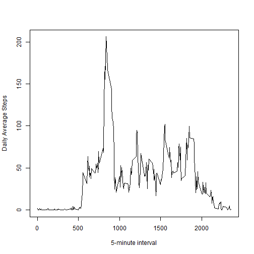
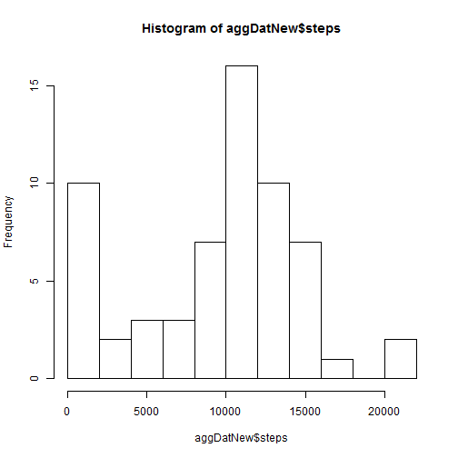
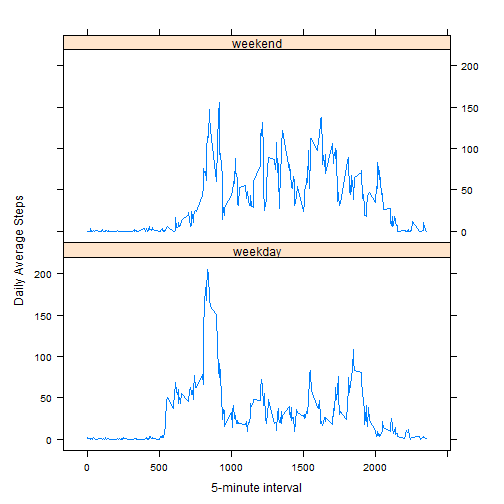

Reproducible Research - Peer Assessment I - Phong Vu
========================================================

# Introduction

It is now possible to collect a large amount of data about personal movement using activity monitoring devices such as a Fitbit, Nike Fuelband, or Jawbone Up. In this assignment, the device collects data at 5 minute intervals through out the day. The data consists of two months of data from an anonymous individual collected during the months of October and November, 2012 and include the number of steps taken in 5 minute intervals each day.

# Loading and processing the data

* The data has been downloaded from the course website and extracted to be processed in R, the following libraries is needed for further processing:


```r
library(plyr)
library(lattice)
```


* The data is loaded into the working environment using the CSV reader function:
  

```r
actDat = read.csv("activity.csv")
```


# What is mean total number of steps taken per day?

* The data is then transformed into an aggregated data that contains the total number of steps taken per day with the missing values are ignored:


```r
aggDat <- aggregate(steps ~ date, data = actDat, sum, na.rm = T)
```

* Plot the histogram of the total number of steps taken per day


```r
hist(aggDat$steps, breaks = 10)
```

 

* The mean and median of the total number of steps taken per day are 

```r
ss = c(mean(aggDat$steps), median(aggDat$steps))
ss
```

```
## [1] 10766 10765
```


# What is the average daily activity pattern?

* Make a time series plot (i.e. type = "l") of the 5-minute interval (x-axis) and the average number of steps taken, averaged across all days (y-axis)

```r
intDat <- aggregate(steps ~ interval, data = actDat, mean, na.rm = T)

names(intDat) <- c("interval", "avgStep")

plot(avgStep ~ interval, data = intDat, xlab = "5-minute interval", ylab = "Daily Average Steps", 
    type = "l")
```

 

* Which 5-minute interval, on average across all the days in the dataset, contains the maximum number of steps?


```r
ind = which(intDat$avgStep == max(intDat$avgStep))
ind
```

```
## [1] 104
```

# Imputing missing values

* The total number of missing values in the dataset (i.e. the total number of rows with NAs) is computed as

```r
nmiss <- colSums(is.na(actDat))
nmiss
```

```
##    steps     date interval 
##     2304        0        0
```

* Devise a strategy for filling in all of the missing values in the dataset. I used a strategy to fill the missing values with the median for that 5-minute interval. 

* First of all, a temporary dataset is created to compute the median of steps taken at each 5-minute interval where the steps data is not missing

```r
medDat <- aggregate(steps ~ interval, data = actDat, median, na.rm = T)

names(medDat) <- c("interval", "medStep")
```

* This data set is joined with the original data set by the interval:

```r
joinDat <- join(actDat, medDat, by = "interval", type = "left", match = "all")
```

* I set the values of steps equal to the values of median steps when the values of steps are missing. 

```r
joinDat$steps[is.na(joinDat$steps)] <- joinDat$medStep[is.na(joinDat$steps)]
```


* The data with filled missing values are extracted from the joined dataset using first three columns

```r
fillDat <- joinDat[, c(1:3)]
```

* Using the filled dataset, I made a histogram of the total number of steps taken each day and calculated the mean and median total number of steps taken per day.


```r
aggDatNew <- aggregate(steps ~ date, data = fillDat, sum, na.rm = T)

hist(aggDatNew$steps, breaks = 10)
```

 

```r

ss0 = c(mean(aggDatNew$steps), median(aggDatNew$steps))
ss0
```

```
## [1]  9504 10395
```

* Comparing to the previous histogram of the original dataset, the new histogram has higher first bin, which contains the imputed missing steps values. The mean and median of the total steps taken per day are smaller since the values are imputed by median values which are smaller than the mean values.

# Are there differences in activity patterns between weekdays and weekends?

* Create a new factor variable in the dataset with two levels - "weekday" and "weekend" indicating whether a given date is a weekday or weekend day.


```r
fillDat$weekday <- "weekday"

fillDat$weekday[weekdays(as.Date(fillDat$date)) %in% c("Saturday", "Sunday")] = "weekend"
```

* Make a panel plot containing a time series plot (i.e. type = "l") of the 5-minute interval (x-axis) and the average number of steps taken, averaged across all weekday days or weekend days (y-axis). 


```r
wkeDat <- aggregate(steps ~ interval + weekday, data = fillDat, mean, na.rm = T)

xyplot(steps ~ interval | factor(weekday), data = wkeDat, aspect = 1/2, xlab = "5-minute interval", 
    ylab = "Daily Average Steps", type = "l")
```

 

It can be seen from the plots that people tend to workout more at the weekend, reflected by the higher values of total steps at each 5-minute interval. A few exceptions occur at the 5-minute interval from roughly 800 to 950 when people workout more in the weekday. These data correspond to the lunch-break time.
